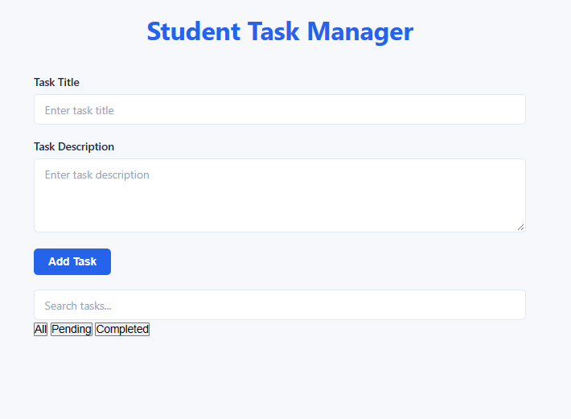
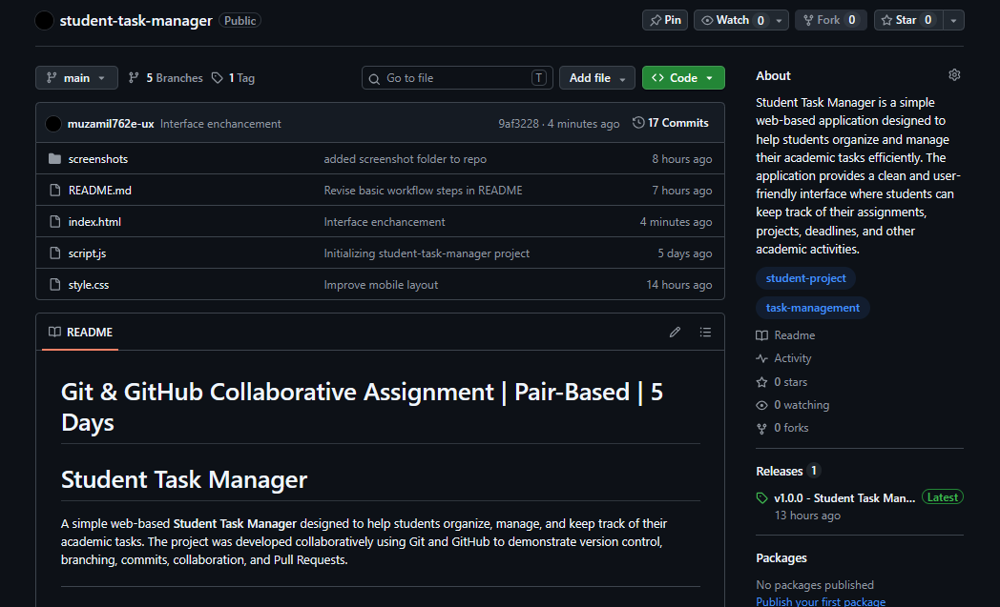
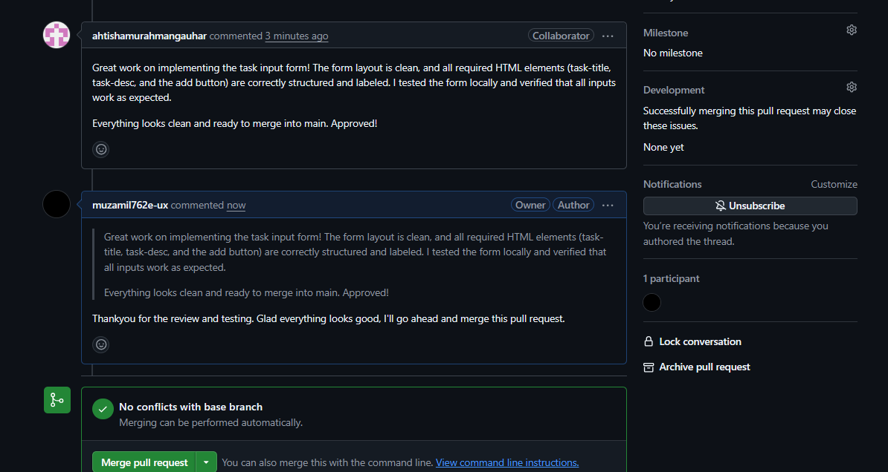

# **Git & GitHub Collaborative Assignment | Pair-Based | 5 Days**

# Student Task Manager

A simple web-based **Student Task Manager** designed to help students organize, manage, and keep track of their academic tasks. The project was developed collaboratively using Git and GitHub to demonstrate version control, branching, commits, collaboration, and Pull Requests.

---

## 📌 Project Description

The **Student Task Manager** is a simple and user-friendly web application that allows students to manage their academic tasks in one place.

The main purpose of this project is to provide students with an organized way to keep track of assignments, projects, deadlines, and other academic activities.

The project  demonstrates the practical use of **Git and GitHub collaborative development workflows** in real-life projects.

---

## 👥 Team Members

| Name | Role |
|------|------|
| Muhammad Muzamil | Project Lead / HTML / GitHub Repo Management |
| Ahtisham Ur Rehman | CSS / UI Styling / Git Collaboration |

---

## ⭐ Features

- Add and manage student tasks
- Display tasks in an organized interface
- Clean and simple user interface
- Responsive styling
- CSS-based visual design
- Collaborative development using GitHub
- Feature branches and Pull Requests

---

## 🛠 Technologies

The following technologies were used in this project:

- **HTML5** – Structure of the web application
- **CSS3** – Styling and visual design
- **Git** – Version control
- **GitHub** – Remote repository and collaboration
- **Visual Studio Code / Code Editor** – Development environment

---

# 🔄 Git Workflow

The project follows a feature-branch based Git workflow.

### Basic Workflow

```text
 Create Project
       ↓
 Initialize Git
       ↓
 Create Commits
       ↓
 Create GitHub Repository
       ↓
 Create Branches
       ↓
 Develop Features
       ↓
 Push Branches
       ↓
 Create Issues
       ↓
Create Pull Requests
       ↓
 Code Review
       ↓
     Merge
       ↓
Create and Resolve Merge Conflict
       ↓
Use Git Recovery Commands
       ↓
Create Tag and Release
```

---

# 🌳Branches

- main
- feature/md-style
- feature/task-form
- feature/task-search
- feature/task-style

  ---

#  💻 Git Commands Demonstrated

Initialize a Repository
```
git init
```

Clone the Repository
```
git clone https://github.com/muzamil762e-ux/student-task-manager.git
```

Check Repository Status
```
git status
```

View Branches
```
git branch
```

Create a New Branch
```
git checkout -b feature/task-style
```

Switch Branch
```
git checkout main
```

Stage Changes
```
git add .
```

Commit Changes
```
git commit -m "Update CSS styling"
```

Push a Branch
```
git push -u origin feature/task-style
```

Pull Latest Changes
```
git pull origin main
```

View Commit History
```
git log --oneline --graph --all
```

Add Remote Repository
```
git remote add origin https://github.com/muzamil762e-ux/student-task-manager.git
```

View Remote Repository
```
git remote -v
```

Git tag
```
git tag
```

Git revert
```
git revert
```
# 🌐 GitHub Features Demonstrated

The project demonstrates the following GitHub features:

- GitHub Repository
- Repository collaboration
- Collaborator access
- Branch management
- Pull Requests
- Pull Request review
- Merging branches
- Commit history
- Remote repository
- Repository files
- GitHub version history

# ▶️ How to Run

**Step 1:** Clone the repository
```
git clone https://github.com/muzamil762e-ux/student-task-manager.git
```

**Step 2:** Open the project
```
cd student-task-manager
```

**Step 3:** Open the HTML file

Open the main HTML file in a web browser.


The application can also be opened using the Live Server extension in Visual Studio Code.

# 📸 Screenshots

Main Interface

Add a screenshot of the Student Task Manager interface here.


Task Management Interface

Add a screenshot showing the task management section.


GitHub Repository

Add a screenshot showing the GitHub repository and branches.


Pull Request

Add a screenshot showing the Pull Request and merge process.




# Versions


| Version | Description                               |
| ------- | ----------------------------------------- |
| v0.1    | Initial project structure created         |
| v0.2    | Added HTML structure                      |
| v0.3    | Added CSS styling                         |
| v0.4    | Improved task manager interface           |
| v0.5    | Collaborative GitHub workflow implemented |
| v1.0    | Final project version                     |


# 👨‍💻 Contributors

- **Muhammad Muzamil**
  - Created and managed the GitHub repository
  - Developed the HTML structure
  - Managed the main branch
  - Managed Git workflow and repository organization
  - Reviewed and merged Pull Requests
    
- **Ahtisham Ur Rehman**
  - Worked on CSS styling
  - Improved the user interface
  - Created and worked on feature branches
  - Committed and pushed changes
  - Collaborated through GitHub Pull Requests
